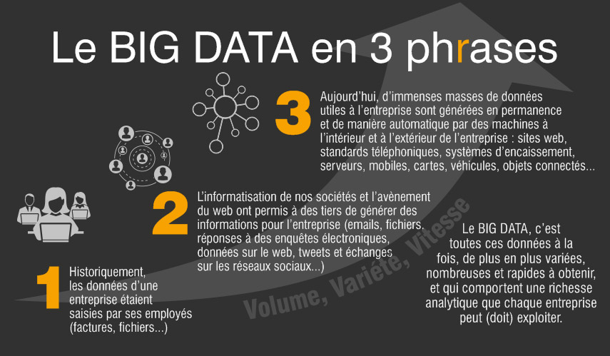
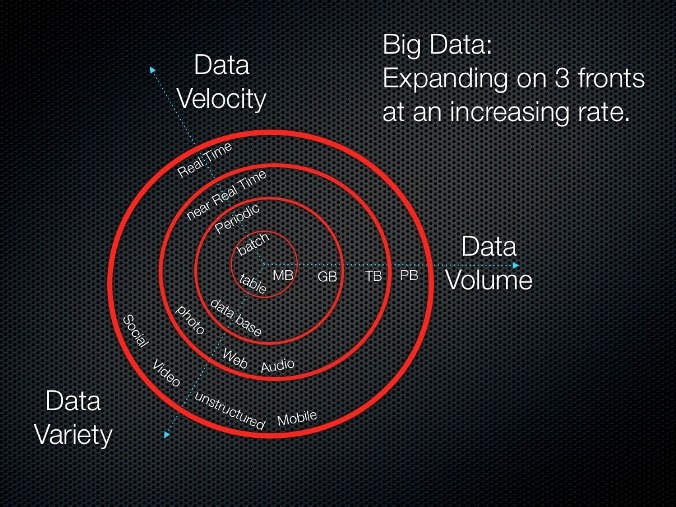
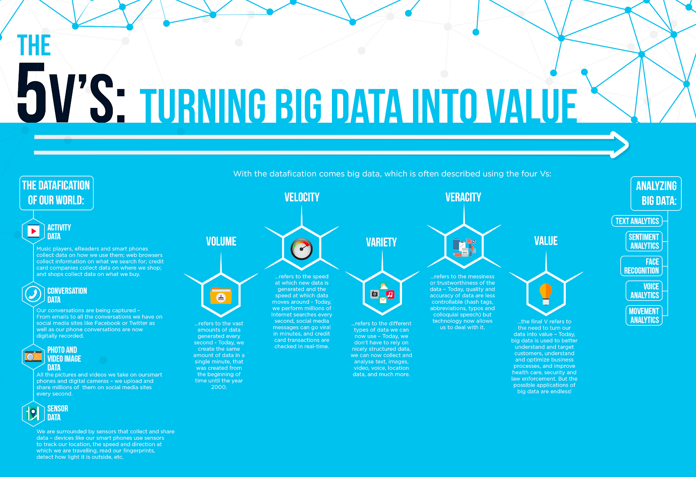
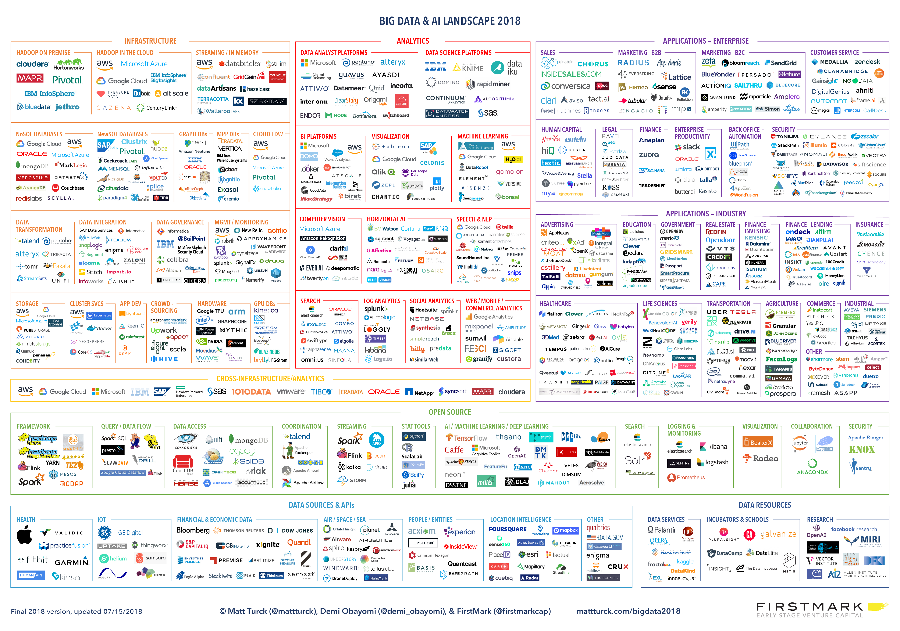

<!-- $theme: gaia -->

Big Data - Hadoop
===
#### Sébastien Jardin :fr: - DevOps :metal: ####
#### Oct. 2018 ####

---
# Définition :book: #

>Le big data, littéralement « grosses données », ou mégadonnées, parfois appelées données massives, désigne des ensembles de données devenus si volumineux qu'ils dépassent l'intuition et les capacités humaines d'analyse et même celles des outils informatiques classiques de gestion de base de données ou de l'information.
>
> <small>-- *[BigData - Wikipedia, the free encyclopedia](https://fr.wikipedia.org/wiki/Big_data)*</small>

---
# 
---

# Les 3V
# 

---

# Puis les 5v
# 

---
# Tour d’horizon :telescope: #
 
 

---

# Landscape 2018 :earth_africa: #



---
# The solutions :collision:
3 leaders : Mapr/Cloudera/HortonWorks (The past years ago)
2 leaders: Mapr/Cloudera-HortonWorks (2018 S4)

 

---
# Darwin Theory or Not:crystal_ball: #

B.I : Données froides, données structurées/formalisées,indicateurs
DataLake:  Data Warehouse V2, données brutes
Big-Data:  Révolution, Temps-réel, illimité

---
# Débouchés :briefcase: #

<br />

```
- Chief Data Officer (CDO)
- Business Intelligence Manager
- Data Scientist
- Data Analyst
- Le Data Miner
- Master Data Manager
- Data Protection Officer
```
---
# Chiffres clés #

- Cdiscount
  - 4 Clusters
  -  200 Tio compressés
- Uber
  - Ubber 100+ Petabytes

(1peta = 1000Tio) donc 102 400 TB

---


---
# Merci :pray: #
## Des questions :question: ##
<br />


<br />

Créer avec [Marp](https://yhatt.github.io/marp/) en Markdown, Libre et gratuit !

<!-- $theme: gaia -->
